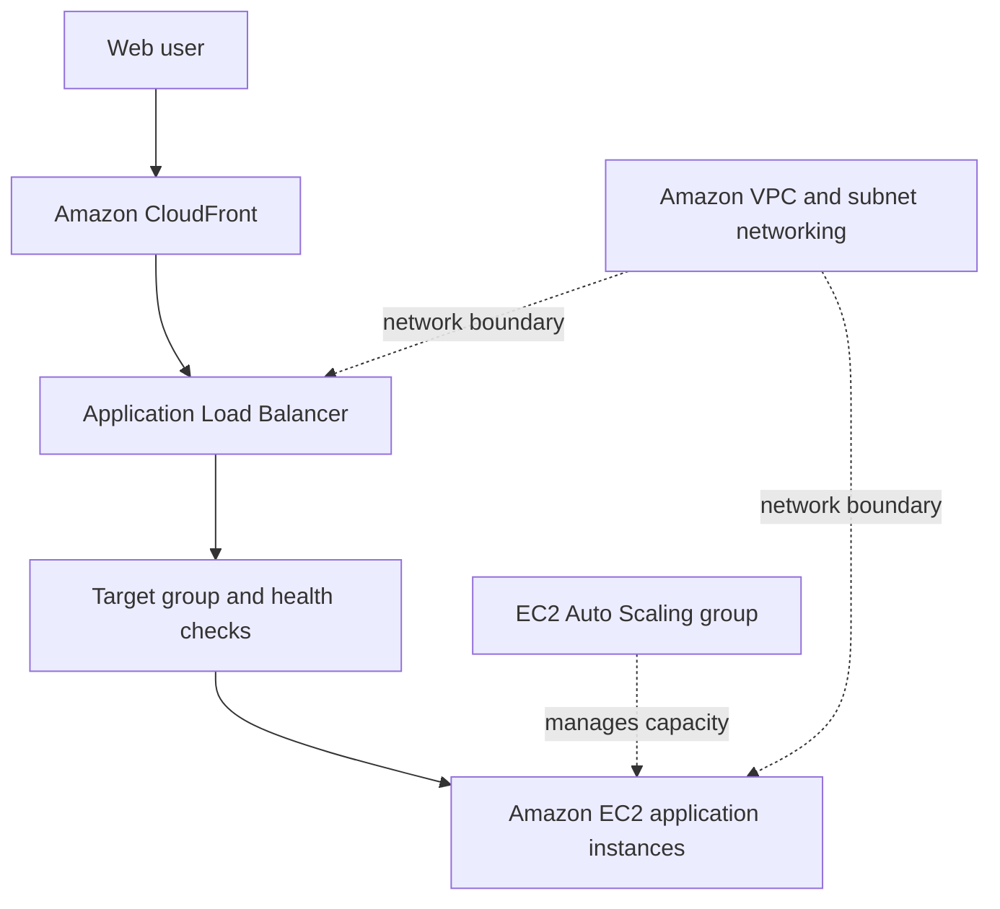
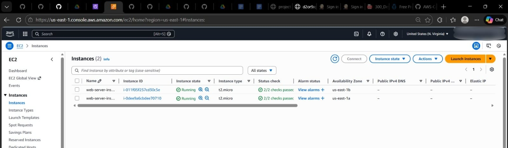

# Highly Available & Secure Web Infrastructure on AWS

**AWS EC2 · Application Load Balancer · Auto Scaling · CloudFront · VPC · IAM · Security Groups**

A hands-on AWS infrastructure project demonstrating how a web application can be delivered through a **scalable, load-balanced, security-conscious architecture**. The implementation combines CloudFront edge delivery, an Application Load Balancer (ALB), EC2 compute, target-group health checks, Auto Scaling, and VPC networking.

> **Project status:** Implemented and documented. The AWS resources were intentionally deleted after validation to avoid ongoing charges. This repository retains the architecture, deployment screenshots, and cleanup documentation; it is **not** a currently running website.

## Architecture




**Request flow:** User → CloudFront → ALB → Target Group → EC2 → Application

CloudFront provides an edge-facing entry point. The ALB routes requests to registered, healthy EC2 targets. The Auto Scaling Group is used for compute-capacity management, while the VPC, subnets, security groups, and IAM provide infrastructure-level networking and access controls.

## What I implemented

| Area | Implementation |
| --- | --- |
| Compute | Deployed EC2 instances for the application workload. |
| Load balancing | Configured an Application Load Balancer and target group to route traffic to EC2 instances. |
| Health monitoring | Checked target-group health and validated application access through the ALB. |
| Scaling | Set up an EC2 Auto Scaling architecture to support changing compute requirements. |
| Edge delivery | Configured CloudFront in front of the application and validated the output. |
| Networking | Used an AWS VPC and public subnet configuration, with security-group controls and NAT-based outbound connectivity during setup. |
| Access control | Used AWS IAM roles/policies to manage permissions. |
| Cloud operations | Captured deployment evidence and removed AWS resources after testing to avoid ongoing costs. |

## AWS services used

- **Amazon EC2:** Application compute.
- **Application Load Balancer and Target Groups:** Request routing and backend health checks.
- **EC2 Auto Scaling:** Managed capacity design.
- **Amazon CloudFront:** Content delivery and edge entry point.
- **Amazon VPC, Subnets, Internet Gateway, NAT Gateway:** Networking and traffic paths.
- **Security Groups:** Network access control between components.
- **AWS IAM:** Identity and permission management.

## Deployment and validation evidence

The screenshots below document the AWS resources and application outputs observed during this project.

### 1. CloudFront

| Distribution | Application output |
| --- | --- |
|  |  |

CloudFront was configured in front of the load-balancing layer to serve as the public-facing entry point.

### 2. Load balancer

| ALB configuration | Output served through ALB |
| --- | --- |
|  |  |

The application was reached through the ALB rather than relying solely on a direct instance endpoint.

### 3. Target-group health


The target-group view shows the health-check state captured during validation. Health checks allow the ALB to route requests to healthy registered targets.

### 4. EC2 compute



### 5. VPC and public subnets

| Public subnet 1 | Public subnet 2 |
| --- | --- |
|  |  |

The network layout was designed to support a multi-subnet AWS deployment.

## Validation summary

The project documentation and screenshots demonstrate:

- CloudFront distribution and application output.
- ALB setup and application access through the load balancer.
- Registered target-group health status.
- Running EC2 compute instances.
- VPC subnet configuration and infrastructure documentation.

**Scope clarification:** This repository demonstrates a **high-availability-oriented design**. It does **not** document an Availability Zone outage simulation, a measured zero-downtime recovery test, a specific Auto Scaling recovery time, or an RDS Multi-AZ deployment. Those results should not be claimed without separate implementation and evidence.

### Why the repository is not labeled “3-tier”

The current evidence primarily covers **edge delivery, networking, load balancing, and compute**. A separate application/database tier and its configuration artifacts are not documented. The title therefore reflects the infrastructure that can actually be demonstrated, rather than claiming a completed three-tier application.

## Repository structure

```text
.
├── README.md
├── architecture/
│   └── Architecture-diagram.jpeg
├── notes/
│   └── cleanup-steps.md
└── screenshots/
    ├── cloudfront/
    │   ├── cloudfront-distribution.jpeg
    │   └── cloudfront-output.jpeg
    ├── ec2/
    │   └── running-ec2-instances.jpeg
    ├── load-balancer/
    │   ├── alb.jpeg
    │   └── alb-output.jpeg
    ├── target-group/
    │   └── target-group-healthy.jpeg
    └── vpc-subnets/
        ├── vpc-subnets-public-subnet-1.jpeg
        └── vpc-subnets-public-subnet-2.jpeg
```

> Image paths above are preserved from the original project documentation. Keep the existing `architecture/`, `screenshots/`, and `notes/` folders in the repository when replacing this README.

## How the project was deployed

This repository is a **documented hands-on implementation**, not an Infrastructure-as-Code deployment kit. The AWS environment was configured and validated as part of the project and subsequently cleaned up. The screenshots and architecture diagram are the project evidence; there is no `terraform apply` or one-command deployment process supplied here.

For someone recreating the same general architecture, the work is typically organized into the following phases:

1. Create the VPC, subnets, and required internet/network routing.
2. Configure security groups and IAM permissions for the necessary AWS services.
3. Prepare the application on EC2 and register instances with an ALB target group.
4. Configure ALB listeners, routes, and target-group health checks.
5. Configure an Auto Scaling Group for EC2 capacity management.
6. Create a CloudFront distribution pointing to the application entry point.
7. Validate instance/target health, access through the ALB, and CloudFront output.
8. Capture evidence and remove the temporary AWS resources when finished.

These steps summarize the architecture; they are **not** automated deployment instructions or a claim that outage/load tests were performed.

## Cleanup and cost management

All provisioned project resources were removed after validation to limit AWS charges. Cleanup covered the CloudFront distribution, ALB, target groups, Auto Scaling Group, EC2, NAT Gateway, associated network resources, and related infrastructure.

See [AWS resource cleanup steps](notes/cleanup-steps.md) for the recorded procedure.

## Future enhancements (not implemented in the documented project)

- Add repeatable Terraform or CloudFormation templates.
- Extend the implementation with a documented application and RDS database layer.
- Configure CloudWatch alerts, load-test scenarios, and recorded Auto Scaling behavior.
- Test instance/AZ failure scenarios and record recovery metrics.
- Add HTTPS end-to-end validation and automated security checks.

## Author

**Nidhi Kumari** · [GitHub](https://github.com/Nidhi8901) · [Portfolio](https://nidhikumari-portfolio.netlify.app)
